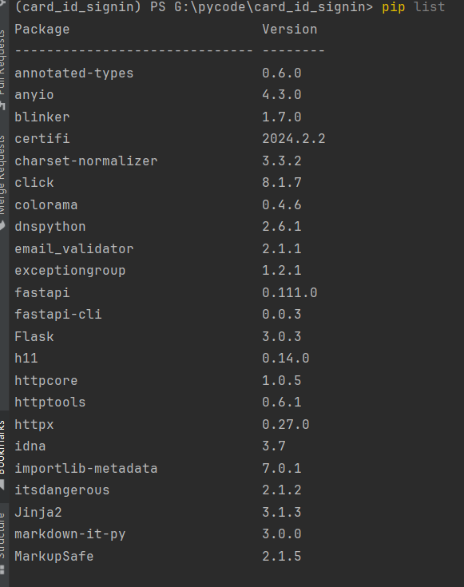
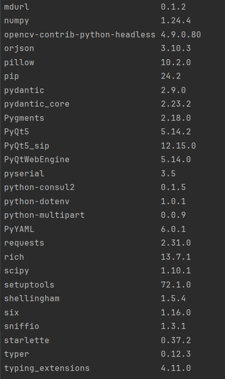
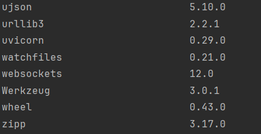
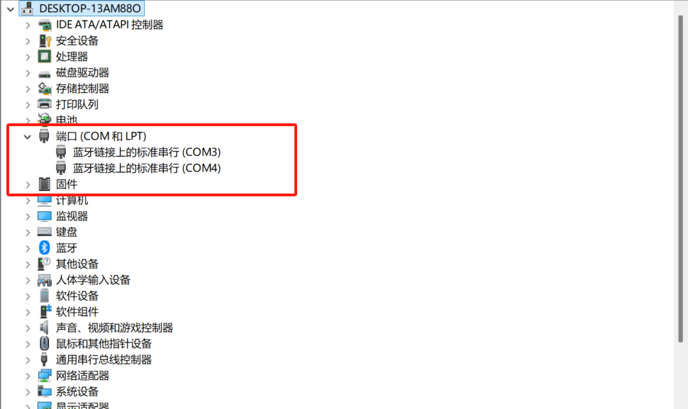
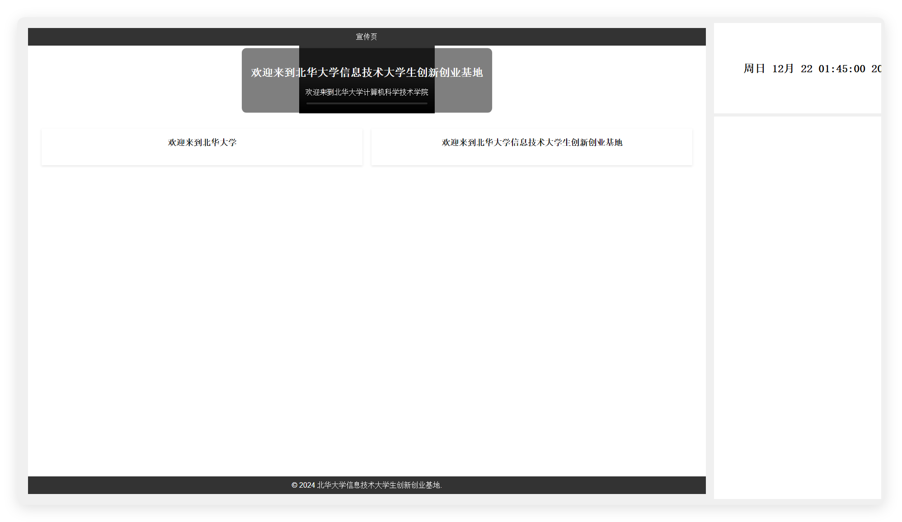
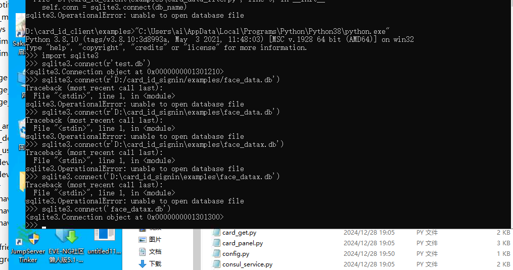

# 安装指引
推荐使用windows部署，Linux下会导致web容器内无法播放视频

## 推荐python3.8
## 前置
如果你的是python3.8就对应改命令，结合自己环境


防止pip到别的python，请严格遵循python -m pip的语法，确保使用的是对应环境的pip

某python的pip升级命令
```python -m pip install --upgrade pip```

设置镜像源，报错说明版本还没升级
```python -m pip config set global.index-url https://pypi.tuna.tsinghua.edu.cn/simple```
## 当前完整pip list截图




## windows部署本项目教程

### 环境安装
##### 1
```shell
pip install -r requirements.txt
```
##### 2
然后手动安装本地的pyqt的whl包，先安装doc里的[不存在doc，文件服务器下载](https://file.easyus.top/files/Data/card%E9%A1%B9%E7%9B%AE%E4%BE%9D%E8%B5%96/)

按顺序执行！
- pip install [PyQt5-5.14.2-5.14.2-cp35.cp36.cp37.cp38-none-win_amd64.whl](doc%2FPyQt5-5.14.2-5.14.2-cp35.cp36.cp37.cp38-none-win_amd64.whl)
- pip install [PyQtWebEngine-5.14.0-5.14.2-cp35.cp36.cp37.cp38-none-win_amd64.whl](doc%2FPyQtWebEngine-5.14.0-5.14.2-cp35.cp36.cp37.cp38-none-win_amd64.whl)
##### 3
然后找到你的python环境目录，找到site-packages\PyQt5\Qt\bin目录，进去
- 解压[需要覆盖替换.zip](doc%2F%D0%E8%D2%AA%B8%B2%B8%C7%CC%E6%BB%BB.zip)把里面的文件复制进该目录，覆盖文件（用于支持web的video）
##### 大功告成
环境到这里已经安装完成


### 运行
- config.py的my_ip是当前机器真实ip
- 先修改config.py，注意的是db的位置需要写绝对路径，防止出现不通位置启动路径不同
- 设备管理器查看真实打卡机所在COM端口，修改config.py的card_com，注意大写

- python [find_card_qt_v2.py](examples%2Ffind_card_qt_v2.py) 启动就好



# 下面为过时的教程（保留，不推荐，且不更新维护）
## 新的Ubuntu_desktop18.04
### 1.设置apt源为清华源并apt upgrade
### 2.sudo apt install python3.8
### 3.设置python3.8为默认python
```
which python3.8
sudo update-alternatives --install /usr/bin/python python /usr/bin/python3.8 1
sudo update-alternatives --install /usr/bin/python python /usr/local/bin/python3 2
第二个为兼容默认的，优先级为2
```
### 额外步骤，这步不确定有没有用，照做就行
```sudo apt install python3-pip```

### 4.安装额外工具
```bash
sudo apt-get -y install cmake g++
sudo apt-get -y install mesa-common-dev
sudo apt-get -y install libglu1-mesa-dev
```
### 5.pip换源，没法换需要在有代理的网络环境下先更新pip
```
python -m pip install --upgrade pip
```
```python -m pip config set global.index-url https://pypi.tuna.tsinghua.edu.cn/simple```

### 6.拉取代码，傻子都会
### 7.安装requirement.txt

### 8. sudo apt-get install libxcb-xinerama0
这步解决qt运行不起来，xcb报错，此版本环境下应该是缺这个，其他问题结合文末链接自己debug

### 9.已经能运行find_[find_card_qt_v2.py](examples%2Ffind_card_qt_v2.py)
记得修改网络和config.py里的配置

### 10.运行前记得给dev/ttyS0的777权限，不然会报错的


# 全局解决问题
## linux下常见问题
https://blog.csdn.net/LOVEmy134611/article/details/107212845 解决qt-xcb
## windows下常见问题

换相对路径，不过日后一定要保证启动的方式一致，否则导致打开的数据库容易不一致,建议在项目根目录 `python examples/find_card_qt_v2.py` 去启动
